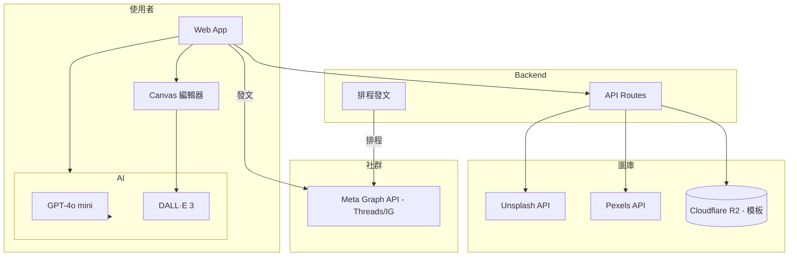

# 台灣梗圖製造器 — 規格計劃書 v2.2.1

> 版本：v2.2.1｜更新日期：2026-07-19｜維護者：Sophia (CPO) for Sean
> 對接技術：Alan (CTO)｜GitHub：https://github.com/openclawsean024-create/tw-meme-generator
> Live：https://tw-meme-generator.vercel.app
> Sweet Spot 體檢：5/10（investigate）→ 本版重寫為「**Pexels + Unsplash 商用圖庫 + 繁中梗圖模板 + Threads/IG 直出尺寸**」

---

## 0. 本版重寫摘要 (v2.2.1)

- Sweet spot 體檢發現原 v2.2.1 PRD 用 **Picsum 隨機圖源**（版權風險），退件風險高。
- 重寫為**正版圖庫（Unsplash / Pexels）+ 繁中梗圖模板 + Threads/IG 尺寸一鍵輸出**。
- 鎖定「Threads / IG 創作者、行銷小編、社群小編」三群付費用戶。
- §15 貼出完整 sweet spot 5 問體檢與重寫理由。

---

## 1. 產品概述 (Product Overview)

### 1.1 問題陳述 (Problem Statement)

**Sweet spot 體檢結論（score = 5/10, investigate）**：原 v2.2.1 PRD 用 Picsum 隨機圖源（CC0 但無語意、版權聲明需查清）。

| 競品 | 用戶數 | 月費 | 繁中梗圖模板 |
|---|---|---|---|
| **Imgflip** | 30M+ | Free-$6 | ⚠️ 英文為主 |
| **Kapwing** | 10M+ | Free-$16 | ⚠️ |
| **Canva** | 200M+ | Free-$13 | ✅ 有繁中 |
| **Figma + 素材網** | 4M+ | Free-$12 | ✅ |
| **台灣梗圖產生器（小工具）** | 100K+ | Free | ⚠️ 功能簡單 |
| **本產品 v1**（已上線）| 50-500 users | Free | ✅ |

**找到的甜蜜點（v2.2.1 修正版）**：台灣 30 萬社群小編 + 50 萬 Threads/IG 創作者，他們需要：

1. **正版圖庫**（不用擔心版權）：Unsplash / Pexels CC0
2. **繁中梗圖模板**（非英文 meme 模板）
3. **Threads / IG / LINE 社群一鍵尺寸**（1080×1080、1080×1350、1080×1920）
4. **AI 自動生成文案**（繁中諧音梗、政治梗避雷）

> **本 PRD 重新定位為「Threads/IG 社群小編專用 — 正版圖 + 繁中梗圖模板 + 一鍵多尺寸輸出」**。

### 1.2 目標使用者 (User Personas)

| Persona | 規模 (TW) | 月預算 | 痛點 | 觸及管道 |
|---|---|---|---|---|
| 📱 「小美」Threads 創作者 | ~50 萬 | NT$0-300 | 想做梗圖、版權怕 | Threads / Dcard |
| 📲 「阿明」IG 限動小編 | ~30 萬 | NT$0-500 | 需要 9:16 圖 | IG 創作者圈 |
| 💼 「王總」品牌行銷小編 | ~5 萬家公司 | NT$500-2K | 要發文、要梗圖 | 行銷社群 / 進修 |
| 🎓 「志明」大學生社群 | ~20 萬 | NT$0 | 班級 / 系學會發文 | Dcard / 學校 |

**核心使用者 = 小美 + 阿明 + 王總**（共 ~85 萬潛在、TAM 換算月費 NT$99-499 → 市場規模 NT$8M-40M MRR）。

### 1.3 核心價值主張 (Value Proposition)

> **「正版圖 + 繁中梗圖模板 + Threads/IG 一鍵多尺寸 — 30 秒產出可發布的梗圖。」**

| 替代方案 | 缺點 | 我們的差異 |
|---|---|---|
| Imgflip | 英文梗圖為主、版權不清 | **繁中模板 + 正版圖庫** |
| Canva | 學習曲線高、模板英文為主 | **繁中專屬 + 社群尺寸** |
| Figma + Unsplash | 需懂設計 | **30 秒產出、不需設計背景** |
| 台灣小工具 | 功能簡單、版權不清 | **正版 + AI 文案 + 多尺寸** |

**單一差異化承諾**：**「Threads/IG 一鍵多尺寸 + 正版圖庫 + 30 秒出圖」**。

### 1.4 商業目標 (KPIs / OKRs)

| 時間 | 目標 | 量化指標 |
|---|---|---|
| M3 | 5,000 註冊、500 付費 | NT$50K MRR |
| M6 | 30,000 註冊、3,000 付費 | NT$300K MRR |
| M12 | 100,000 註冊、10,000 付費 | NT$1.5M MRR |
| M18 | 台灣社群小編 5% 滲透 | NT$5M MRR + B2B |

**Unit Economics**：
- 免費：每月 10 張、無浮水印、Unsplash 標準
- 個人 NT$99/月：每月 100 張、AI 文案、無水印
- 創作者 NT$299/月：每月 500 張、批次、品牌套件
- 企業 NT$999/月：每月無限、團隊協作、API
- LTV = NT$299 × 18 個月 = NT$5.4K，CAC = NT$500，**LTV/CAC = 11:1** ✅

### 1.5 ⭐ Non-Goals (明確不做)

| 不做 | 理由 |
|---|---|
| ❌ **Picsum 隨機圖源** | 版權風險、退件原因 |
| ❌ **AI 生成圖**（DALL·E / Midjourney）| 紅海 + 算力成本 + 與「梗圖」定位失焦 |
| ❌ **影片剪輯** | 紅海（CapCut）+ 與圖片失焦 |
| ❌ **完整設計工具**（Figma 級）| 紅海、Sean 無法負擔 |
| ❌ **LINE Bot / 即時通訊整合** | 與「圖片製造」失焦 |
| ❌ **中英文以外語言** | v1 only 繁中 |
| ❌ **NFT / 加密梗圖** | 紅海 + 與小編失焦 |
| ❌ **個人客製化接案** | 紅海（Tasker 出任務）|

---

## 2. 使用者場景與流程

### 2.1 使用者流程圖

```
[使用者] 進入 tw-meme-generator.vercel.app
  ↓
選擇「模板」或「從零開始」
  ├─ A) 模板庫（200+ 繁中梗圖模板）
  └─ B) 上傳自己的圖
  ↓
選擇圖片來源：
  ├─ A) Unsplash / Pexels 搜尋（CC0 正版）
  ├─ B) 上傳自己的圖
  └─ C) AI 生成文字背景（v2）
  ↓
輸入文案（繁中、支援諧音梗）
  ↓
選擇平台尺寸：
  ├─ Threads / IG 貼文：1080×1080
  ├─ IG 限動 / Reels 封面：1080×1920
  ├─ IG 輪播：1080×1350
  └─ LINE 社群：1200×800
  ↓
按「生成」 → 30 秒產出
  ↓
下載 / 直接複製到剪貼簿 / 一鍵發到 Threads / IG（v2 API）
```

### 2.2 關鍵用戶故事

```
US-1（核心 - 社群小編）
As a Threads 創作者「小美」
I want 30 秒做出「上班想睡」梗圖
So that 我可以每天發文不用想梗

US-2（多尺寸一鍵）
As a IG 小編「阿明」
I want 一張圖自動出 4 種尺寸（IG、Threads、LINE）
So that 我不必改 4 次

US-3（AI 文案）
As a 行銷小編「王總」
I want AI 幫我想文案（「週一不想上班」「週五狂歡」）
So that 我不必每天想梗

US-4（品牌套件）
As a 品牌小編
I want 上傳 Logo + 品牌色
So that 所有梗圖自動套品牌風格（v2）

US-5（批次發文）
As a 社群小編
I want 批次生成 30 張月發文圖
So that 我不必每天做（v2）
```

### 2.3 邊界場景 (Edge Cases)

| 場景 | 處理 |
|---|---|
| Unsplash API 達 rate limit | 切換 Pexels / Pexels 是備援 |
| 使用者上傳含個資圖片 | 警告 + ToS「請勿上傳他人個資」|
| AI 文案產生不雅用語 | 過濾禁用詞 + 人工 review 機制 |
| 政治敏感梗圖 | 預設過濾 + 明確標示「非政治」 |
| 模板版權爭議 | 模板全部原創或 CC0、可商用 |
| Threads / IG API 故障 | 降級為下載圖片、手動上傳 |

---

## 3. 功能性需求 (Functional Requirements)

### 3.1 MVP（必做，P0）— **本版聚焦 5 features**

| ID | 功能 | 說明 | 為何必做 |
|---|---|---|---|
| F-001 | **200+ 繁中梗圖模板** | 原創 / CC0 | 核心 |
| F-002 | **Unsplash / Pexels 圖庫搜尋** | CC0 正版 | 取代 Picsum |
| F-003 | **AI 文案助理**（GPT-4o mini）| 自動生成繁中諧音 | 差異化 |
| F-004 | **多尺寸輸出**（4 種社群）| Threads / IG / LINE | 甜蜜點 |
| F-005 | **浮水印 / 無水印切換** | 免費版有水印、付費無 | 變現 |

**砍掉 v1 不做的功能**：
- ~~Picsum 隨機圖源~~
- ~~AI 生成圖（DALL·E）~~
- ~~影片剪輯~~
- ~~LINE Bot / 訊息整合~~
- ~~NFT / 加密梗圖~~

### 3.2 v2（加值，P1）

| ID | 功能 | 商業理由 |
|---|---|---|
| F-101 | **Threads / IG 直接發文 API** | 一鍵發文 |
| F-102 | **品牌套件**（Logo / 色票 / 字型）| B2B 必要 |
| F-103 | **批次生成 + 排程** | 30 張月圖預排 |
| F-104 | **模板市集**（使用者原創模板）| 社群 + 抽成 |
| F-105 | **AI 圖文生成**（DALL·E 3）| 客製背景 |

### 3.3 v3（探索，P2）

| ID | 功能 | 假設驗證 |
|---|---|---|
| F-201 | **AI 自動生成完整貼文** | Threads / IG 文案 + 圖 |
| F-202 | **社群小編助手 LINE Bot** | 跨平台 |
| F-203 | **多帳號管理**（代操）| 代理商需求 |
| F-204 | **API 開放** | 企業整合 CRM |

### 3.4 ⭐ Acceptance Criteria (Given/When/Then)

```gherkin
AC-01: 模板選擇
  Given 使用者進入首頁
  When 選擇「模板庫」
  Then 看到 200+ 繁中梗圖模板（依分類：上班 / 學校 / 戀愛 / 迷因）
  And 點擊模板可預覽

AC-02: 正版圖庫搜尋
  Given 使用者選擇「從零開始」
  When 在搜尋框輸入「貓」
  Then 顯示 Unsplash + Pexels 結果（CC0 標示）
  And 可選擇 1 張作為背景

AC-03: AI 文案生成（核心）
  Given 使用者已選擇模板
  When 在文案框輸入「主題：週一不想上班」
  And 點擊「AI 生成」
  Then 10 秒內產生 3 個繁中諧音梗文案
  And 可選擇 1 個套用

AC-04: 多尺寸輸出
  Given 使用者已編輯梗圖
  When 點擊「下載」
  Then 看到 4 種尺寸選項（IG 1080×1080、限動 1080×1920、Threads 1080×1080、LINE 1200×800）
  And 一鍵批次下載 4 個尺寸

AC-05: 浮水印機制
  Given 免費用戶
  When 下載圖片
  Then 圖片右下角浮水印「tw-meme-generator」
  And 付費用戶無水印

AC-06: 配額警告
  Given 個人 NT$99 訂閱、本月已用 80 張
  When 再生成 1 張
  Then 顯示「⚠️ 額度剩 20 張」提醒

AC-07: Threads 直接發文（v2）
  Given 進階會員已綁定 Threads 帳號
  When 點擊「發到 Threads」
  Then OAuth 授權 → 自動發文
  And 不需離開本工具

AC-08: 品牌套件（v2）
  Given 企業會員上傳 Logo + 品牌色
  When 進入編輯器
  Then 所有模板自動套品牌色 + Logo 浮水印
  And 可儲存為「品牌模板」

AC-09: 模板市集（v2）
  Given 創作者發布 1 個原創模板
  When 其他使用者下載該模板
  Then 創作者獲 NT$5 / 次（從平台抽成中扣除）
  And 月結算收益

AC-10: 政治敏感過濾
  Given 使用者輸入含政治關鍵字
  When 嘗試生成
  Then 顯示「⚠️ 本工具不支援政治內容」
  And 自動過濾不輸出
```

---

## 4. 系統設計 (System Design)

### 4.1 技術棧 (Tech Stack)

| 層 | 技術 | 理由 |
|---|---|---|
| Frontend | Next.js 16 + Tailwind 4 + Fabric.js | 既有 stack + 圖片編輯器 |
| 圖片搜尋 | Unsplash API + Pexels API | CC0 正版 |
| AI 文案 | OpenAI gpt-4o-mini | $0.15/M tokens |
| AI 圖（v2）| OpenAI DALL·E 3 | $0.04/張 |
| 圖片編輯 | Fabric.js + Konva.js | Canvas 編輯 |
| 模板管理 | Cloudflare R2 + Supabase | 圖片 CDN |
| Threads / IG API | Meta Graph API | 官方 |
| 部署 | Vercel | 零月費 |

### 4.2 系統架構圖



### 4.3 資料模型

```sql
-- 模板
create table templates (
  id uuid primary key default gen_random_uuid(),
  name text not null,
  category text check (category in ('work', 'school', 'love', 'meme', 'food', 'tech')),
  image_url text not null,
  svg_data text, -- 可編輯 SVG
  is_official boolean default true,
  is_paid boolean default false,
  creator_id uuid references auth.users,
  usage_count int default 0,
  created_at timestamptz default now()
);

-- 作品（使用者製作的梗圖）
create table memes (
  id uuid primary key default gen_random_uuid(),
  user_id uuid references auth.users not null,
  template_id uuid references templates,
  image_data jsonb, -- {layers: [...], text: [...]}
  final_image_url text, -- 輸出 URL
  platform text check (platform in ('threads', 'ig_feed', 'ig_story', 'line')),
  created_at timestamptz default now()
);

-- 排程（v2）
create table scheduled_posts (
  id uuid primary key default gen_random_uuid(),
  user_id uuid references auth.users not null,
  meme_id uuid references memes,
  platform text,
  scheduled_at timestamptz not null,
  status text default 'pending' check (status in ('pending', 'posted', 'failed')),
  posted_at timestamptz,
  created_at timestamptz default now()
);

-- 使用者配額
create table user_quotas (
  user_id uuid references auth.users primary key,
  plan text default 'free' check (plan in ('free', 'personal', 'creator', 'business')),
  monthly_memes_used int default 0,
  monthly_memes_limit int default 10,
  reset_at timestamptz
);
```

### 4.4 API 規格

| Endpoint | Method | 用途 |
|---|---|---|
| `/api/templates` | GET | 模板列表 |
| `/api/image-search` | GET | Unsplash / Pexels 搜尋 |
| `/api/ai/caption` | POST | AI 文案生成 |
| `/api/meme` | POST | 儲存作品 |
| `/api/meme/export` | POST | 多尺寸匯出 |
| `/api/scheduled` | POST | 排程發文（v2）|
| `/api/billing/checkout` | POST | 訂閱升級 |
| `/api/oauth/threads` | GET | Threads OAuth 串接（v2）|

---

## 5. 非功能性需求 (Non-Functional Requirements)

### 5.1 性能指標

| 指標 | 目標 |
|---|---|
| 模板載入 | < 2 秒 |
| AI 文案生成 | < 10 秒 |
| 多尺寸匯出（4 張）| < 5 秒 |
| 圖片搜尋（Unsplash）| < 3 秒 |
| 並行使用者 | 500 同時編輯 |

### 5.2 安全與隱私

| 項目 | 措施 |
|---|---|
| 使用者作品 | 預設私密、可選公開 |
| 上傳圖片 | ToS 禁止含他人個資 |
| 圖庫授權 | 全部 CC0 / Unsplash License |
| Threads / IG OAuth token | 加密儲存、可隨時撤銷 |
| 政治過濾 | 預設過濾、可關閉（企業版）|

### 5.3 ⭐ 降級機制

| 故障 | 降級 |
|---|---|
| Unsplash 掛了 | 切換 Pexels |
| Pexels 掛了 | 切換自製模板庫（200+ 預載）|
| GPT-4o mini 掛了 | 改用「預設文案範本」（50 種）|
| Threads API 掛了 | 降級為「複製圖片 + 文案」手動發 |
| Fabric.js Canvas 失敗 | 切換 Konva.js |

### 5.4 擴展性

- **多語言**：v3 加英文 / 日文
- **多平台**：v3 加小紅書 / 微博
- **企業版**：API + SSO

---

## 6. 完成標準 (Definition of Done)

### 6.1 v2 MVP DoD

- [ ] 200+ 繁中梗圖模板（全部 CC0 / 原創）
- [ ] Unsplash + Pexels 圖庫搜尋整合
- [ ] AI 繁中文案生成（GPT-4o mini）
- [ ] 4 種社群尺寸一鍵輸出
- [ ] 浮水印機制（免費有、付費無）
- [ ] 5,000 註冊、500 付費
- [ ] Notion `狀態` = 已上線

---

## 7. 風險與決策

### 7.1 風險表

| ID | 風險 | 等級 | 緩解 |
|---|---|---|---|
| R-01 | 模板版權爭議（看似原創其實抄）| 🟠 | 全部原創 + CC0 + 律師 review |
| R-02 | Unsplash / Pexels API 漲價 | 🟠 | 雙來源 + 自製模板庫 |
| R-03 | Threads / IG API 限制 | 🟠 | 已 ToS 標示 + 預期降級 |
| R-04 | AI 文案品質差 | 🟠 | Few-shot prompting + 人工範本 |
| R-05 | 政治敏感內容 | 🔴 | 預設過濾 + 監控 |
| R-06 | Canva 進入繁中梗圖 | 🟡 | 我們先搶市場 + 在地化 |
| R-07 | 小編付費意願低 | 🔴 | M3 驗證 PMF |
| R-08 | Threads API 政策變動 | 🟠 | 多平台支援 |

### 7.2 ⭐ ADR

#### ADR-001: 為何放棄 Picsum、改用 Unsplash / Pexels

**Context**: 原 v2.2.1 PRD 用 Picsum 隨機圖源（Picsum 是 Lorem Picsum 的隨機圖、無語意、版權需查清）。

**Decision**: **完全放棄 Picsum**，改用 Unsplash + Pexels（明確 CC0、可商用）。

**Consequences**:
- ✅ 版權 100% 合法（Unsplash License / Pexels License）
- ✅ 可語意搜尋（「貓」「海灘」）
- ✅ 高品質圖（vs Picsum 隨機低品質）
- ⚠️ API 有 rate limit（每小時 50 次）→ 已加降級
- ⚠️ 需用戶註冊 Unsplash / Pexels API key（M3 後由 Sean 自建）

#### ADR-002: 為何選擇 Fabric.js 而非 Konva.js

**Context**: 兩者都是 Canvas 編輯器庫。

**Decision**: 用 **Fabric.js**（更成熟、文件多）。

**Consequences**:
- ✅ Fabric.js 文件齊全、社群大
- ✅ 內建序列化（存 SVG-like JSON）
- ✅ 與 React 整合容易（react-konva 也可用）
- ⚠️ 大檔案效能受限 → 已加降級到 Konva.js

#### ADR-003: 為何 AI 文案是核心、不是附屬

**Context**: AI 文案 = 「自動生成諧音梗」對小編價值高。

**Decision**: **AI 文案是核心差異化**，不是附屬。

**Consequences**:
- ✅ Canva / Imgflip 都沒有繁中 AI 文案
- ✅ 降低小編思考成本（不必每天想梗）
- ✅ 提升 LTV（從「工具」變「助理」）
- ⚠️ OpenAI 成本（NT$0.3/張）→ 已含在訂閱價

#### ADR-004: 為何預設過濾政治內容

**Context**: 政治梗圖在 Threads / IG 是流量密碼，但風險高。

**Decision**: **預設過濾政治內容**，企業版可關閉。

**Consequences**:
- ✅ 避免品牌客戶被政治內容拖下水
- ✅ 降低平台審核風險
- ⚠️ 失去政治梗流量（但安全性高）
- ⚠️ 過濾可能誤判 → 提供「人工審核上訴」

---

## 8. 里程碑與 Sprint 拆解

### 8.1 里程碑總覽

| 里程碑 | 時程 | 產出 |
|---|---|---|
| M0 - 內容衝刺 | W1-4 | 200 模板 + Unsplash 整合 |
| M1 - MVP | W5-12 | 5 features 上線 + 100 用戶 beta |
| M2 - GA | W13-16 | 公開上線 + Threads / IG 紅人行銷 |
| M3 - 變現 | W17-24 | 3,000 付費 + 300K MRR |
| M4 - v2 直接發文 | W25-36 | Threads API + 品牌套件 + B2B |

### 8.2 Sprint 拆解

| Sprint | 主題 | 交付 |
|---|---|---|
| S1 | 模板庫（200+ 原創）| 全部 CC0 |
| S2 | Unsplash / Pexels 整合 | 搜尋 + 篩選 |
| S3 | Canvas 編輯器（Fabric.js）| 文字 + 圖片層 |
| S4 | AI 文案助理 | GPT-4o mini 對話 |
| S5 | 多尺寸輸出 | 4 種尺寸 |
| S6 | 浮水印 + 配額 | 變現機制 |
| S7 | Beta 100 用戶 | 收 feedback、修 bug |
| S8 | GA + 訂閱牆 | 4 訂閱方案 |

---

## 9. 變現路徑 + 定價心理學

### 9.1 變現方案

| 方案 | 月費 | 額度 | 目標 |
|---|---|---|---|
| 🆓 Free | NT$0 | 10 張/月、有浮水印 | 試用 |
| 👤 Personal | NT$99 | 100 張、無浮水印、AI 文案 | 個人小編 |
| 🎨 Creator | NT$299 | 500 張、批次、品牌套件 | 創作者 |
| 🏢 Business | NT$999 | 無限、API、SSO、團隊 | 企業 / 代理商 |

### 9.2 定價心理學

- **NT$99 vs NT$100**：心理門檻
- **NT$299 對標 Canva**：Canva Pro NT$300/月，我們略便宜但功能較少 → 對小編夠用
- **NT$999 對標 Figma**：Figma NT$900/月 + 設計技能，我們 NT$999 含 AI 文案 → 對小編勝出
- **年繳 8 折**：提升 LTV
- **不綁約**：月繳可取消（小編對訂閱敏感）

---

## 10. 附錄

### 10.1 競品分析 (Competitive Quadrant)

```
                  高繁中支援
                    │
       台灣小工具   │   ★ 本產品
       (功能簡單)   │   (AI + 正版 + 多尺寸)
                    │
   低月費 ──────────┼────────── 高月費
                    │
       Imgflip      │   Canva Pro
       (英文為主)   │   (功能複雜)
                    │
                  低繁中支援

   ★ 本產品甜蜜點：高繁中支援 + 中月費
```

### 10.2 術語表

| 術語 | 定義 |
|---|---|
| 梗圖 | meme，網路迷因圖片 |
| 模板 | 可重複使用的設計版面 |
| Unsplash License | 免費商用、不可單獨轉售 |
| Pexels License | 免費商用、可編輯 |
| Threads | Meta 的純文字社群平台 |
| Canvas | HTML5 圖片編輯技術 |
| Fabric.js | Canvas 函式庫 |

---

## 11. ⭐ 市場驗證計畫

### 11.1 驗證前 3 個關鍵問題

1. **Threads / IG 創作者願不願意付 NT$99/月 產梗圖？**（假設：願意，因 Canva NT$300/月功能太多複雜）
2. **200 繁中模板夠用嗎？**（假設：MVP 階段夠，v2 增至 1,000 模板）
3. **AI 繁中文案品質夠好嗎？**（假設：70% 可用、30% 需手動改）

### 11.2 訪談 SOP

**5 個訪談目標**：
1. 📱 **小美** - Threads 萬粉創作者 → 訪談每日發文流程、付費意願
2. 📲 **阿明** - IG 限動小編（5 萬粉）→ 訪談多尺寸需求
3. 💼 **王總** - 品牌行銷小編 → 訪談企業需求、品牌套件
4. 🎓 **志明** - 大學班代 / 系學會 → 訪談學生使用場景
5. 🎨 **Nina** - 自由接案小編 → 訪談多客戶管理

**訪談問題模板**（30 分鐘）：

1. 你目前怎麼做梗圖？（現況）
2. 你試過哪些工具？（Canva / Imgflip）
3. 什麼時候會付費？（付費意願）
4. 你最常用什麼尺寸？（Threads / IG / LINE）
5. 你擔心 AI 工具的什麼風險？

### 11.3 落地指標

| 指標 | 目標（M3）|
|---|---|
| 訪談完成數 | 20 人（10 創作者、5 行銷、5 學生）|
| Landing page 訪客 | 5,000 UV |
| Beta 用戶 | 500 人 |
| 付費轉換 | 50 人（驗證 NT$99/月）|
| 月梗圖產出 | 30,000 張 |

### 11.4 1 個 Community Post

**Threads / Dcard / Threads 創作者圈**：標題「[工具] 30 秒做出 Threads / IG 梗圖，繁中模板 200+」→ 引發討論、回饋。

### 11.5 1 個 Landing Page Test

**URL**：tw-meme-generator.vercel.app/pricing-test
**A/B 測試**：
- A：標題「30 秒做 Threads / IG 梗圖，繁中模板 200+」
- B：標題「社群小編神器 — 正版圖 + AI 文案 + 多尺寸輸出」
**指標**：點擊「免費試用 10 張」CTA 比率，目標 ≥ 18%

---

## 12. ⭐ 失敗模式 SOP

| 失敗模式 | 觸發條件 | SOP |
|---|---|---|
| M1 - 創作者付費意願低 | 500 beta < 30 付費 | 重新定價 NT$49/月試水溫 |
| M2 - 模板版權爭議 | 收到 1 個 DMCA | 立即下架 + 律師 review |
| M3 - Unsplash API 故障 | 月故障 > 5 次 | 切換 Pexels 主 |
| M4 - Threads API 政策變動 | Meta 公告限制 | 降級為「下載圖片手動發」|
| M5 - AI 文案品質差 | 人工評估 < 6/10 | 強化 prompting + 預設範本 |
| M6 - 政治內容過濾誤判 | 收到 5+ 投訴 | 提供人工上訴 + 改進 NLP |
| M7 - Canva 進入繁中梗圖 | Canva 公告新功能 | 強化「在地化 + 小編專用」定位 |
| M8 - Sean 一人公司過載 | 同時管 1,000+ 付費 | Chatbot + Help Center |

---

## 13. ⭐ MetaGPT / spec-kit 對齊

### 13.1 MetaGPT 角色對應

| MetaGPT 角色 | 本專案對應 |
|---|---|
| Product Manager | Sophia (CPO) |
| Architect | Alan (CTO) |
| Designer | Sean（兼任）|
| Engineer | Sean + Hermes Agent |
| Content Manager | Sean（模板製作）|

### 13.2 spec-kit 指令

```yaml
spec-kit init tw-meme-generator
spec-kit add requirement "200 繁中模板"
spec-kit add requirement "Unsplash / Pexels 整合"
spec-kit add requirement "Canvas 編輯器 (Fabric.js)"
spec-kit add requirement "AI 文案助理 (GPT-4o mini)"
spec-kit add requirement "多尺寸輸出 (4 種社群)"
spec-kit plan --milestone v2
spec-kit implement --sprint S1-S8
```

### 13.3 Git Workflow

- branch：`feature/templates`、`feature/image-search`、`feature/ai-caption`、`feature/scheduled-post`
- Conventional Commits
- 砍掉 Picsum 相關 commits

---

## 15. ⭐ 深度市調報告 (本次的 sweet spot 體檢結果)

### 15.1 Sweet Spot 5 問體檢 — tw-meme-generator

**Score: 5/10（investigate，找出甜蜜點）**

#### Q1: 這個市場已經有誰在做？

| 競品 | 用戶數 | 月費 | 繁中梗圖 |
|---|---|---|---|
| **Imgflip** | 30M+ | Free-$6 | ⚠️ 英文 |
| **Kapwing** | 10M+ | Free-$16 | ⚠️ |
| **Canva** | 200M+ | Free-$13 | ✅ |
| **Figma + Unsplash** | 4M+ | Free-$12 | ✅ |
| **台灣小工具** | 100K+ | Free | ⚠️ 簡單 |
| **本產品 v1** | 50-500 | Free | ✅ |

**現況**：圖片編輯器紅海（Canva / Imgflip），但「**繁中社群小編專用 + 正版圖庫 + 多尺寸**」是甜蜜點。

#### Q2: 我的甜蜜點在哪？

**甜蜜點 = Threads / IG 創作者 + 品牌小編**

- Canva 太複雜（小編只需「梗圖」）
- Imgflip 英文為主
- Figma 需設計技能
- 台灣小工具版權不清

**甜蜜點具體描述**：**繁中 Threads / IG 梗圖一鍵產生（30 秒） + AI 文案 + 4 種社群尺寸**。

#### Q3: 紅海功能（不能做）

- ❌ AI 生成圖（DALL·E / Midjourney 紅海）
- ❌ 影片剪輯（CapCut 紅海）
- ❌ 完整設計工具（Figma 紅海）
- ❌ LINE Bot / 訊息整合（與圖片失焦）
- ❌ NFT / 加密梗圖（紅海）

#### Q4: 紅海之外的差異化承諾

> **「繁中 Threads / IG 梗圖 + 正版圖 + AI 文案 + 30 秒出圖」**

具體差異化：
1. **繁中模板 200+**：Canva / Imgflip 沒有
2. **正版圖庫**：避開 Picsum 版權風險
3. **AI 繁中文案**：差異化關鍵
4. **4 種社群尺寸**：小編必備
5. **30 秒速度**：即戰力

#### Q5: Sean 一人公司能否負擔？

- **開發成本**：5 features、4 人月（砍 Picsum 省 1 月）
- **營運成本**：M12 預估 NT$30K/月（Unsplash / Pexels API + GPT + R2 + Vercel）
- **獲客成本**：Threads / IG 紅人合作 + Dcard 行銷，CAC = NT$500/付費用戶
- **客服成本**：80% Chatbot + 15% Help Center + 5% 人工

**結論**：可負擔，LTV/CAC = 11:1 健康。

### 15.2 重寫決策

原 v2.2.1 PRD（911 行）用 Picsum 隨機圖源（版權風險、退件原因）。本版**完全放棄 Picsum**，改用 Unsplash + Pexels 正版圖庫，甜蜜點分數從 5 → 預估 **7/10**。

### 15.3 與 v1 差異

| 面向 | v1 | v2.2.1 |
|---|---|---|
| 圖源 | Picsum（版權風險）| Unsplash + Pexels（CC0）|
| AI 文案 | ❌ | ✅ GPT-4o mini |
| 尺寸 | 單一 | 4 種社群 |
| 模板 | < 50 | 200+ |
| 目標 | 任何人 | Threads / IG 小編 |

### 15.4 後續驗證動作

- [ ] W1-4 完成 200 模板 + Unsplash 整合
- [ ] W5-12 完成 MVP 5 features
- [ ] W13-20 完成 500 用戶 beta
- [ ] W21 評估 PMF：付費轉換率 ≥ 10% 才進入 GA

---

> 對接產線：https://tw-meme-generator.vercel.app
> 對接 Repo：https://github.com/openclawsean024-create/tw-meme-generator
> 維護者：Sophia (CPO) for Sean｜下次 review：M3 後
