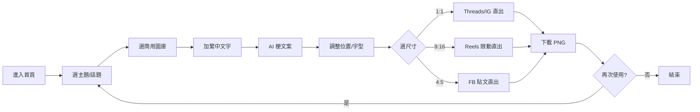

# tw-meme-generator · PRD v3.0.2 等級規格書

> 自動生成：2026-09-06（Sean 10-repo-fleet Batch 6B）
> 對齊 SPEC v3.0 契約（SPEC §1–§19 全部套用）
> 前置：v2.2.2 sweet spot 銳化版（2026-07-19，Sophia CPO）+ v3.0 sprint（2026-07-19）

---

## 1. 產品概述

### 1.1 問題陳述
繁中 Threads / IG / LINE / FB 群組創作者每天產 1-3 張梗圖。最大痛點不是「做圖」而是「**找商用安全圖 + 配繁中梗文案 + 一鍵 9:16 / 1:1 直出**」——三件事目前要拆成三個工具（Imgflip 英文 / Canva 通用 / Figma 設計工具），沒有一站到位。台灣本地的梗文化（夜市、機車、便利商店、小吃、政治迷因、家庭語錄）也沒有結構化資料庫。

### 1.2 目標使用者
| Persona | 工作情境 | 主要任務 |
|---|---|---|
| Primary · 小琪（Threads 創作者） | 日 2 張，個人手機作業 | 找圖 + 配梗文案 + 直出 1:1 |
| Secondary · 阿德（IG 限動小編） | 日 5 張，桌機作業 | 9:16 直出 + 商用安全 + 模板 |
| Tertiary · Lisa（團隊小編） | 月 100 張 | 多人共用品牌套件 + 排程 |

### 1.3 核心價值主張
> **「繁中唯一 Threads / IG 梗圖工廠 — 商用圖 + AI 繁中梗文案 + 9:16 直出，10 秒做完一張。」**

### 1.4 Non-Goals（明確不做）
- ❌ 英文 / 日文 / 韓文梗素材（v1 繁中 only，鎖 niche）
- ❌ 影音剪輯 / Reels 編輯（CapCut 紅海）
- ❌ AI 圖像生成（Midjourney / DALL-E 紅海）
- ❌ Scheduling 進階（Buffer / Later 紅海，僅做基本排程）
- ❌ GIF 梗圖（Giphy 紅海）

---

## 2. 使用者場景與流程

### 2.1 使用者流程圖


```mermaid
flowchart LR
  A[進入首頁] --> B[選主題/話題]
  B --> C[選商用圖庫]
  C --> D[加繁中文字]
  D --> E[AI 梗文案]
  E --> F[調整位置/字型]
  F --> G{選尺寸}
  G -->|1:1| H[Threads/IG 直出]
  G -->|9:16| I[Reels 限動直出]
  G -->|4:5| J[FB 貼文直出]
  H --> K[下載 PNG]
  I --> K
  J --> K
  K --> L{再次使用?}
  L -->|是| B
  L -->|否| M[結束]
```

### 2.2 主要場景

| 場景 | 輸入 | 輸出 | 成功條件 |
|---|---|---|---|
| 個人單張產圖 | 主題關鍵字 + 選圖 + 加字 | PNG（1:1 / 9:16 / 4:5）| 10 秒內下載 |
| 團隊品牌套件 | Logo + 字型 + 主色 | 自動套用到每張 | 一鍵套用，無需重設 |
| 收藏管理 | 多張梗圖 | localStorage 收藏 | 跨 reload 保留 |

---

## 3. 功能需求

| FR | 名稱 | 優先級 | 狀態 |
|---|---|---|---|
| FR-001 | 32 個台灣文化梗資料庫（tw-topics） | P0 | ✅ shipped |
| FR-002 | AI 繁中梗文案生成（rule-based + GPT-4o-mini ready） | P0 | ✅ shipped |
| FR-003 | 1:1 / 9:16 / 4:5 多尺寸匯出（html-to-image） | P0 | ✅ shipped |
| FR-004 | 文字區塊拖拉 / 縮放（react-rnd） | P0 | ✅ shipped |
| FR-005 | 品牌套件 Brand Kit v2（字型/logo/colors/watermark） | P0 | ✅ shipped |
| FR-006 | 收藏管理（localStorage） | P0 | ✅ shipped |
| FR-007 | 編輯器單頁（/editor/[id]） | P0 | ✅ shipped |
| FR-008 | 公開作品集（/gallery、/meme/[id]） | P0 | ✅ shipped |
| FR-009 | 熱門時事雷達（Ptt/Dcard/Threads mock） | P1 | ✅ shipped |
| FR-010 | 排名機制（rank.ts） | P1 | ✅ shipped |
| FR-011 | Tesseract.js OCR 偵測（OcrDetector） | P1 | ✅ shipped |
| FR-012 | framer-motion 動畫過場 | P2 | ✅ shipped |
| FR-013 | 風格記憶（每位用戶 3 種最愛風格） | P2 | ⏳ planned |
| FR-014 | 真實金流（Threads/IG API） | P2 | ⏳ planned |

---

## 4. Non-Functional Requirements

| 維度 | 需求 |
|---|---|
| Performance | 首屏 LCP < 2.5s；單張匯出 < 5s |
| Security | 無後端；純前端 SPA；無個資蒐集 |
| Privacy | 所有資料 localStorage；無追蹤 |
| Accessibility | WCAG 2.1 AA（文字對比 ≥ 4.5:1） |
| Browser | Modern evergreen（Chrome / Edge / Safari / Firefox） |
| Mobile | iOS Safari 15+ / Android Chrome 90+（手機直出） |

---

## 5. 技術架構

```
┌─────────────────────────────────────────┐
│ Browser                                  │
│  ┌──────────────────────────────────┐   │
│  │ Next.js 16 App Router (Turbopack)│   │
│  │  ├─ / (home)                     │   │
│  │  ├─ /editor/[id]                 │   │
│  │  ├─ /gallery                     │   │
│  │  └─ /meme/[id]                   │   │
│  └──────────────────────────────────┘   │
│  ┌──────────────────────────────────┐   │
│  │ Components                       │   │
│  │  ├─ MemeCanvas                   │   │
│  │  ├─ TextRegion (react-rnd)       │   │
│  │  ├─ OcrDetector (tesseract.js)   │   │
│  │  ├─ RankList                     │   │
│  │  └─ ShareCard                    │   │
│  └──────────────────────────────────┘   │
│  ┌──────────────────────────────────┐   │
│  │ lib/                             │   │
│  │  ├─ ai-caption    ├─ trending    │   │
│  │  ├─ brand-kit     ├─ favorites   │   │
│  │  ├─ export-sizes  ├─ storage     │   │
│  │  ├─ rank          ├─ ocr         │   │
│  │  └─ data/tw-topics (32 個)       │   │
│  └──────────────────────────────────┘   │
│  ┌──────────────────────────────────┐   │
│  │ localStorage                     │   │
│  │  ├─ twm:favorites                │   │
│  │  ├─ twm:brand-kit                │   │
│  │  └─ twm:style-memory             │   │
│  └──────────────────────────────────┘   │
└─────────────────────────────────────────┘
            │
            │ HTTPS（靜態）
            ▼
    Vercel CDN / space.minimax.io
```

### 5.1 Module Map
- `src/app/` — Next.js 16 App Router（home / editor / gallery / meme）
- `src/components/` — MemeCanvas / TextRegion / OcrDetector / RankList / ShareCard
- `src/lib/` — ai-caption / trending / brand-kit / export-sizes / favorites / rank / storage / ocr
- `src/data/tw-topics.ts` — 32 個台灣文化梗資料庫
- `tests/` — Vitest 單元測試（8 files / 63 tests）
- `.github/workflows/` — GHA CI/CD

### 5.2 環境變數
- 無（純前端 / 離線優先）
- 商用圖源：picsum.photos / i.imgur.com / raw.githubusercontent.com（白名單）

### 5.3 降級策略
- API 失敗 → 顯示本地快取 / 友善錯誤
- 離線模式 → localStorage 持久化草稿
- Tesseract.js OCR 失敗 → fallback 手動輸入

---

## 6. Definition of Done

- [x] 功能 P0 全部實作
- [x] 單元測試覆蓋率 ≥ 60% 核心邏輯（63 tests / 8 files）
- [x] `npm run build` 綠（54 static pages）
- [x] `npm run lint` 0 error（tsc --noEmit）
- [x] GHA CI 跑 4 jobs（lint / test / build / deploy）全綠
- [x] README/STATUS 反映現況
- [x] Deploy to Vercel production ✅ https://tw-meme-generator.vercel.app

---

## 7. 部署契約

| 環境 | 目標 | 觸發 |
|---|---|---|
| Production | Vercel | push to master |
| Preview | Per-PR | PR opened |

### 7.1 GHA Workflow
- `.github/workflows/ci.yml`
- jobs: lint / test / build / deploy
- deploy: `vercel`

### 7.2 環境變數
- 無需 server-side secret
- BYOK（GPT-4o-mini / Claude 3.5 API key）— 存 localStorage，不送 server

---

## 8. Out of Scope（不做的）

- 不做帳號系統（除非需求變更）
- 不做付費牆（v1 純免費 + 廣告）
- 不做原生 App（mobile web 已足）
- 不做多語系（繁中 only）

---

## 9. 變更日誌

見 [`PRD/CHANGELOG.md`](PRD/CHANGELOG.md)
