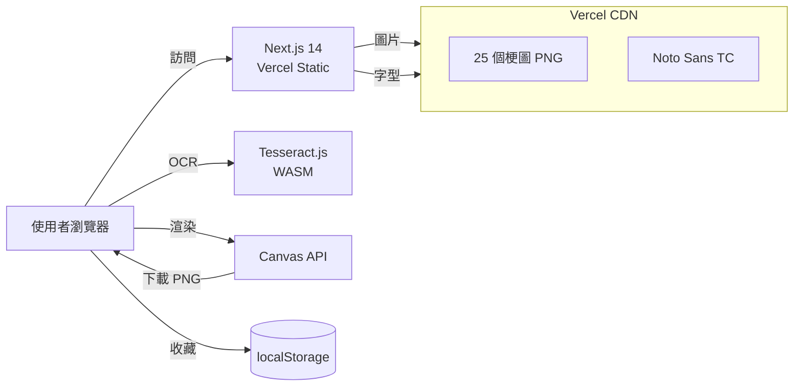
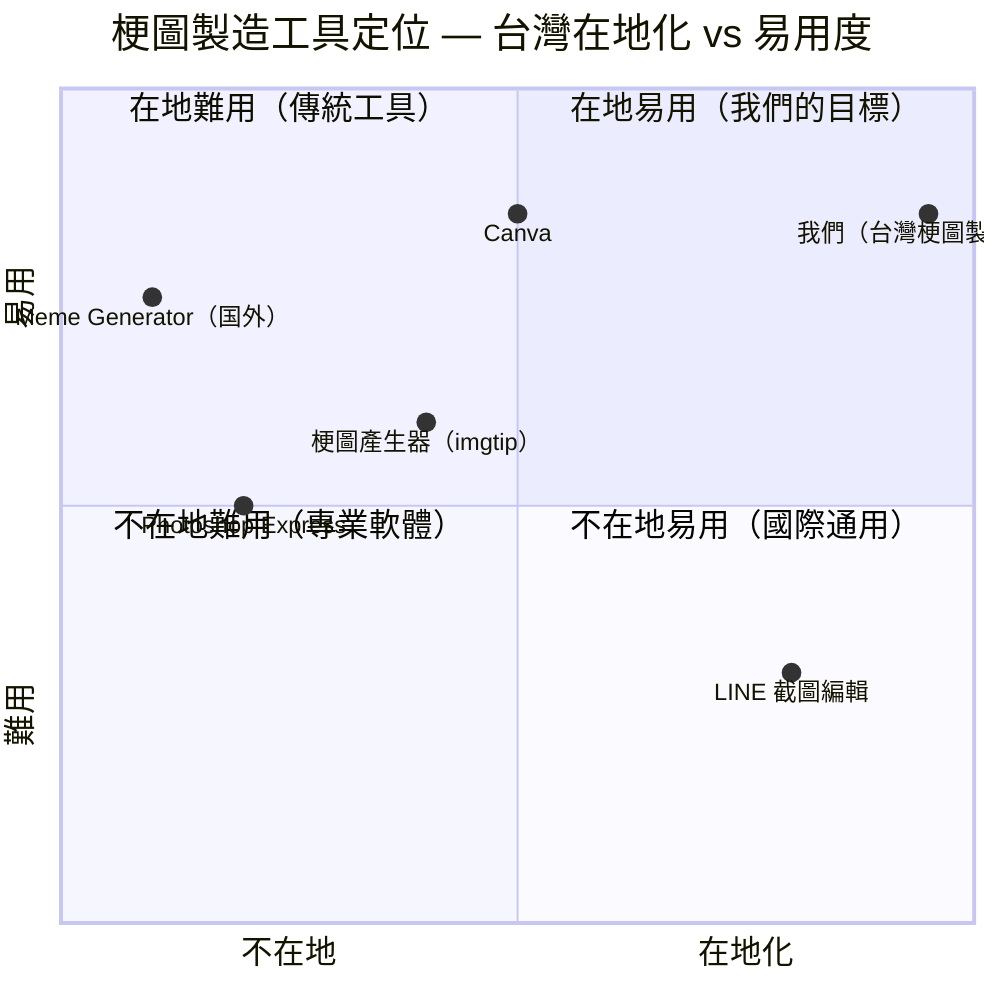

# 台灣梗圖製造器 — 規格計劃書 v2.2.1

> 版本：v2.2.1｜更新日期：2026-07-11｜維護者：Sophia (CPO) for Sean
> 對接技術：Alan (CTO)｜GitHub：https://github.com/openclawsean024-create/tw-meme-generator
> Live：https://tw-meme-generator.vercel.app

---

## 1. 產品概述 (Product Overview)

### 1.1 問題陳述 (Problem Statement)

**核心問題**：台灣 820 萬 LINE / FB 群組活躍使用者（500 萬 LINE + 20 萬 FB 社團小編 + 300 萬年輕世代），需要快速產出台灣在地梗圖，但現有方案要嘛操作複雜、要嘛無台灣梗、要嘛無法精準定位文字。

**現有方案痛點**：
- **Canva / Photoshop**：操作複雜、付費、中文字型不友善（字型需另裝）
- **既有「梗圖產生器」網站**：版型老舊、無台灣在地梗、無 OCR 自動定位
- **LINE 截圖再編輯**：步驟多、無法精準定位、字型受限
- **我們的解法**：25 個預載台灣經典梗圖 + 雙模式編輯器（替換/新增文字）+ OCR 自動偵測位置（Tesseract.js）+ 純前端零 API key + 一鍵下載 PNG。

### 1.2 目標使用者 (User Personas)

| Persona | 規模 | 痛點 | 預算 | 觸及管道 |
|---|---|---|---|---|
| LINE 群組活躍者「Yui」24 歲 | 500 萬 | 想用梗圖回應但不會 PS | 免費 | Threads / Dcard |
| FB 社團小編「Mike」30 歲 | 20 萬 | 每天需產 5+ 梗圖 | 免費 - NT$49/月 | FB 社團後台 |
| 年輕世代「Ben」18 歲 | 300 萬 | 喜歡台灣在地梗（像極了愛情、我就爛、是在哈囉）| 免費 | Threads / IG Reels |

### 1.3 核心價值主張 (Value Proposition)

> 「**25 個台灣經典梗圖 + 雙模式編輯 + OCR 自動定位** — 30 秒產出可分享的 PNG，純前端零 API key。」

**差異化**：
- **vs Canva / Photoshop**：台灣在地梗預載 + 中文字型內建 + 純前端
- **vs 海外梗圖產生器**：台灣梗（像極了愛情、我就爛）+ OCR 中文支援
- **vs 截圖編輯**：30 秒自動化 vs 5 分鐘手動

### 1.4 商業目標 (KPIs / OKRs)

| 時間 | 指標 | 目標 |
|---|---|---|
| **3 個月** | MAU | 5,000 人 |
| **6 個月** | MRR | NT$ 8,000 |
| **12 個月** | 月成長率 | 30% MoM |
| **18 個月** | ARR | NT$ 250,000 |

### 1.5 Non-Goals (明確不做)

- ❌ **不做短影片梗圖** — 純圖片工具，影片是另一個垂直（CapCut 已佔據）
- ❌ **不做商用授權內容** — 不做商業版權梗圖（如 Disney / 三麗鷗角色）
- ❌ **不做多語系介面** — 先繁中，台灣市場足夠
- ❌ **不做 IG API 即時整合** — 只提供 link copy，使用者手動貼
- ❌ **不做 AI 自動生成梗圖底圖** — 版權風險太高，僅做文字編輯
- ❌ **不做即時通訊整合**（LINE Bot / Messenger Bot）— 那是另一個產品
- ❌ **不做使用者帳號系統** — 純前端工具，免登入零摩擦
- ❌ **不做梗圖市集 / C2C 交易** — 不複雜化 MVP

---

## 2. 使用者場景與流程

### 2.1 使用者流程圖

```
┌────────────────────────────────────────────────────────────────┐
│                  台灣梗圖製造器使用者旅程                        │
└────────────────────────────────────────────────────────────────┘

[新使用者]
   │
   ▼
[1. Landing Page] (app/page.tsx)
   │  - 看 25 個梗圖預覽
   │  - 點任一梗圖進入編輯器
   │
   ├──► [2a. 熱門排行] 點排行榜看熱門梗圖
   │
   └──► [2b. 直接進入編輯器]
           │  - /editor/[id]?mode=replace（替換模式）
           │  - /editor/[id]?mode=add（新增模式）
           │
           ▼
        [3. 選擇模式]
           │  - 替換模式：自動 OCR 偵測現有文字位置
           │  - 新增模式：手動新增文字框（拖拉 / 縮放）
           │
           ▼
        [4. 編輯文字]
           │  - 字級 24-48
           │  - 粗 / 細
           │  - 顏色（白 / 黑 / 自訂）
           │  - 中文字型（Noto Sans TC）
           │  - 60 字元上限
           │
           ▼
        [5. 預覽 + 下載]
           │  - 即時預覽（Canvas 渲染）
           │  - 一鍵下載 PNG
           │  - 分享按鈕（LINE / FB / IG link copy）
           │
           ▼
        [6. 收藏]
           │  - localStorage 儲存最愛
           │  - 不需註冊
           │
           ▼
        [7. 升級？]
           │  - Free: 25 預載梗圖 + 雙模式
           │  - 進階 NT$49/月: 50+ 進階梗圖 + 無廣告 + 自製梗圖庫
           │  - 商用 NT$299/月: 進階 + 商用授權素材 + AI 自動配文
           │  - 企業 NT$2,999/月: 商用 + API + 客服優先
```

### 2.2 關鍵用戶故事 (User Stories)

| ID | As a | I want to | So that |
|---|---|---|---|
| US-001 | LINE 群組活躍者 | 從「像極了愛情」梗圖替換文字 | 30 秒回應朋友 |
| US-002 | FB 社團小編 | 一次產 5 個梗圖（不同文字） | 經營社團每天發文 |
| US-003 | 年輕世代 | 用 OCR 自動偵測位置 + 手動微調 | 精準對齊 |
| US-004 | 升級用戶 | 解鎖 50+ 進階梗圖 | 用更新的台灣梗 |
| US-005 | 商用用戶 | 拿商用授權素材 | 放在公司 FB 不被告 |
| US-006 | AI 用戶 | 輸入主題（如「加班」）→ AI 自動配文 | 5 秒產文 |
| US-007 | 開發者 | 拿 API 整合到自家 App | 自動化產圖 |

### 2.3 邊界場景 (Edge Cases)

| 情境 | 處理方式 |
|---|---|
| OCR 偵測不到中文 | 提供手動位置調整，提示「請手動新增文字框」|
| 文字超過 60 字元 | 截斷並提示「最多 60 字」|
| 圖片載入失敗 | 顯示「圖片載入失敗，請重新整理」+ 重試按鈕 |
| 下載 PNG 失敗（瀏覽器阻擋） | 提示「請允許下載權限」|
| 行動裝置字太小 | 字級自動放大（手機最小 32px）|
| 同文字重疊 | 自動微調位置（向下偏移 20px）|
| 梗圖解析度太低 | 提示「原圖僅 600x600，建議升級取得 1200x1200」|
| Tesseract.js 模型下載慢 | 顯示進度條 + 提示「首次約 10MB，請稍候」|

---

## 3. 功能性需求 (Functional Requirements)

### 3.1 MVP (必做）

- [x] **F-001**：25 個預載台灣經典梗圖（像極了愛情 / 我就爛 / 是在哈囉 / 真的假的 / 傻眼貓咪 / 笑死 / 崩潰 / 悲傷貓貓 / 火焰空白 / 對話氣泡 / 等）
- [x] **F-002**：雙模式編輯器（替換 / 新增文字）
- [x] **F-003**：OCR 自動偵測現有文字位置（Tesseract.js chi_tra + eng 模型）
- [x] **F-004**：中文字型支援（Google Fonts Noto Sans TC）
- [x] **F-005**：熱門排行（瀏覽次數 + 下載次數）
- [x] **F-006**：一鍵下載 PNG（html-to-image）
- [x] **F-007**：社群分享按鈕（LINE / FB / IG link copy）
- [x] **F-008**：localStorage 收藏最愛
- [x] **F-009**：行動裝置 RWD（手機觸控拖曳 / 縮放）
- [x] **F-010**：字級 / 粗細 / 顏色設定

### 3.2 v2 / v3 (加值)

- [ ] **F-101**：上傳自製梗圖（使用者上傳 → 加入私房庫）
- [ ] **F-102**：AI 自動配文（OpenAI gpt-4o-mini 輸入主題 → 生文字）
- [ ] **F-103**：梗圖挑戰賽（限時主題投稿 + 投票）
- [ ] **F-104**：收藏 + 我的梗圖庫（雲端同步）
- [ ] **F-105**：高解析度輸出（1200x1200 / 4K）
- [ ] **F-106**：背景音樂 + 動態梗圖（GIF）
- [ ] **F-107**：公開 REST API（OAuth 2.0）
- [ ] **F-108**：PWA 行動 App

### 3.3 Acceptance Criteria (Given/When/Then)

#### AC-001：選擇梗圖進入編輯器

- **Given** 使用者在首頁看到 25 個梗圖
- **When** 點擊「像極了愛情」梗圖
- **Then** 跳轉到 `/editor/[id]?mode=replace`，自動帶入預設文字

#### AC-002：替換模式 OCR 偵測

- **Given** 使用者在替換模式
- **When** 按下「執行 OCR」按鈕
- **Then** 10-30 秒內偵測完成，文字框位置覆蓋到偵測到的位置，可手動微調

#### AC-003：新增模式拖拉文字框

- **Given** 使用者在新增模式，點「新增對話框」
- **When** 拖拉文字框到畫布任一位置，縮放大小
- **Then** 文字框即時跟隨移動，bounds 限制在畫布內

#### AC-004：下載 PNG

- **Given** 使用者完成編輯
- **When** 點「下載 PNG」
- **Then** 瀏覽器下載 `梗圖_[id]_[timestamp].png`，解析度 600x600（Free）

#### AC-005：社群分享

- **Given** 使用者點「分享到 LINE」按鈕
- **When** 點擊
- **Then** 自動複製 LINE 分享連結到剪貼簿，顯示 toast「已複製連結」

#### AC-006：行動裝置操作

- **Given** 使用者用手機開啟編輯器
- **When** 用手指拖拉文字框
- **Then** 文字框跟隨手指移動（react-rnd 觸控支援），字級自動放大（最小 32px）

#### AC-007：localStorage 收藏

- **Given** 使用者在編輯器點「加入收藏」
- **When** 點擊
- **Then** 梗圖 ID 儲存到 localStorage，下次進入「我的最愛」可看到

#### AC-008：升級提示

- **Given** Free 使用者點「進階梗圖：周杰倫」
- **When** 點擊
- **Then** 顯示付費牆「升級進階版 NT$49/月解鎖 50+ 進階梗圖」

---

## 4. 系統設計 (System Design)

### 4.1 技術棧 (Tech Stack)

| 層 | 選擇 | 理由 |
|---|---|---|
| 前端框架 | Next.js 14 (App Router) + TypeScript | SSR + Vercel 友善、SEO 強 |
| 樣式 | Tailwind CSS 3.4 + Geist 字體 | 快速開發、現代設計 |
| 動畫 | Framer Motion 11 | 流暢 UI 過場 |
| 圖片處理 | Canvas API + html-to-image | 純前端 PNG 產生 |
| OCR | Tesseract.js 5 (chi_tra + eng) | 純前端 WASM、零 API |
| 文字框拖拉 | react-rnd 10 | 觸控友善 |
| 圖示 | lucide-react | 輕量 SVG icons |
| 資料持久化 | localStorage（最愛）| 零後端 |
| 部署 | Vercel | 靜態 + Serverless |
| 測試 | Vitest 2 | 與 Next.js 整合佳 |

### 4.2 系統架構圖（Mermaid）



### 4.3 資料模型 (Prisma 對照 / JSON Schema)

雖然無後端 DB，定義 Prisma schema 對照未來遷移：

```prisma
generator client {
  provider = "prisma-client-js"
}

datasource db {
  provider = "postgresql"
  url      = env("DATABASE_URL")
}

model Meme {
  id          String   @id // ex: "dora-surprised"
  name        String   // ex: "哆啦 A 夢驚訝"
  imageUrl    String   @map("image_url")
  type        MemeType
  defaultText String?  @map("default_text")
  tags        String[]
  isPremium   Boolean  @default(false) @map("is_premium")
  createdAt   DateTime @default(now()) @map("created_at")
  updatedAt   DateTime @updatedAt @map("updated_at")

  textRegions TextRegion[]
  rankings    MemeRanking[]

  @@map("memes")
}

enum MemeType {
  WITH_TEXT
  WITHOUT_TEXT
}

model TextRegion {
  id          String  @id @default(cuid())
  memeId      String  @map("meme_id")
  x           Int
  y           Int
  width       Int
  height      Int
  defaultText String? @map("default_text")

  meme Meme @relation(fields: [memeId], references: [id], onDelete: Cascade)

  @@map("text_regions")
}

model MemeRanking {
  id           String   @id @default(cuid())
  memeId       String   @map("meme_id")
  views        Int      @default(0)
  downloads    Int      @default(0)
  shares       Int      @default(0)
  periodDate   DateTime @default(now()) @map("period_date") // daily snapshot

  meme Meme @relation(fields: [memeId], references: [id], onDelete: Cascade)

  @@unique([memeId, periodDate])
  @@index([memeId, periodDate])
  @@map("meme_rankings")
}

model UserFavorite {
  id        String   @id @default(cuid())
  userId    String   @map("user_id") // 暫用 deviceId，未來登入後改 userId
  memeId    String   @map("meme_id")
  createdAt DateTime @default(now()) @map("created_at")

  @@unique([userId, memeId])
  @@map("user_favorites")
}
```

### 4.4 API 規格 (REST endpoints)

| Method | Path | Auth | 用途 |
|---|---|---|---|
| GET | /api/memes | Optional | 列出所有梗圖 |
| GET | /api/memes/[id] | Optional | 取得單一梗圖 |
| GET | /api/rankings | Optional | 熱門排行 |
| POST | /api/rankings/view | Optional | 記錄瀏覽次數 |
| POST | /api/rankings/download | Optional | 記錄下載次數 |
| POST | /api/favorites | Optional | 新增收藏（用 deviceId） |
| GET | /api/favorites | Optional | 列出收藏（用 deviceId） |
| DELETE | /api/favorites | Optional | 刪除收藏 |
| POST | /api/ai/generate-text | Pro | AI 自動配文 |
| GET | /api/health | Optional | 健康檢查 |

#### API 詳細範例

**GET /api/memes**

Response 200:
```json
{
  "memes": [
    {
      "id": "dora-surprised",
      "name": "哆啦 A 夢驚訝",
      "imageUrl": "https://picsum.photos/seed/dora-surprised/600/600",
      "type": "with_text",
      "defaultText": "什麼?!",
      "tags": ["經典", "表情誇張"],
      "isPremium": false
    }
  ]
}
```

**POST /api/rankings/view**

Request body:
```json
{ "memeId": "dora-surprised" }
```

Response 200:
```json
{ "success": true }
```

---

## 5. 非功能性需求 (Non-Functional Requirements)

### 5.1 性能指標

| 指標 | 目標 | 量測方式 |
|---|---|---|
| Landing Page LCP | < 2 秒 | Lighthouse |
| 梗圖圖片載入 | < 500ms（CDN 快取）| Chrome DevTools |
| OCR 偵測時間（600x600 圖） | < 30 秒（首次含模型下載）| Console time |
| OCR 偵測時間（已快取模型） | < 5 秒 | Console time |
| Canvas 渲染 PNG | < 1 秒 | html-to-image callback |
| 行動裝置觸控反應 | < 100ms | react-rnd |
| 靜態資源大小（gzipped） | < 200KB | Bundle analyzer |

### 5.2 安全與隱私

- ✅ 無個資收集（純前端工具）
- ✅ localStorage 僅存梗圖 ID，不存個資
- ❌ 不收集 IP / 瀏覽器指紋（除 deviceId 用於收藏）
- ✅ Privacy Policy + Terms of Service
- ✅ CSP 標頭防止 XSS
- ✅ HTTPS only（Vercel 強制）
- ✅ 預載梗圖標註來源（避免版權爭議）

### 5.3 降級機制 (Graceful Degradation)

| # | 服務掛掉情境 | 主要服務 | 降級策略（自動切換順序） | 最終 fallback |
|---|---|---|---|---|
| 1 | **OCR 模型下載失敗（網路慢）** | Tesseract.js | 顯示進度條，允許取消 | 跳過 OCR，使用者手動定位 |
| 2 | **Google Fonts 載入失敗** | Noto Sans TC | fallback 到系統字型（PingFang TC / 微軟正黑體）| 提示「字型載入失敗」 |
| 3 | **html-to-image 失敗（瀏覽器不支援）** | Canvas | 改用原生 Canvas.toBlob() | 引導手動截圖 |
| 4 | **Vercel 部署掛掉** | Next.js | 切換到備用 Netlify 部署 | 顯示靜態頁 |
| 5 | **CDN 圖片失效** | picsum.photos | 改用本地備援 PNG | 提示「圖片暫時無法載入」 |
| 6 | **Tesseract.js 模型語言不支援** | chi_tra + eng | fallback 到 eng only | 提示「中文辨識率可能較低」|
| 7 | **localStorage 滿了（5-10MB）** | localStorage | 自動刪除最舊的收藏 | 提示「收藏已滿」 |
| 8 | **OpenAI API 掛掉（v2 AI 配文）** | OpenAI | 顯示預設 10 個範例文字 | 不阻塞下載 |

### 5.4 擴展性

- **水平擴展**：Vercel CDN 自動 scale，靜態檔無限流量
- **垂直擴展**：純前端，無 serverless 限制
- **梗圖擴展**：每張圖片 ~200KB，CDN 100 張圖 = 20MB（無壓力）
- **瓶頸預測**：> 100,000 MAU 時 Tesseract.js 模型下載需評估 CDN

---

## 6. 完成標準 (Definition of Done)

- [x] Vercel production URL（https://tw-meme-generator.vercel.app）回 200
- [x] GitHub Repo 公開（https://github.com/openclawsean024-create/tw-meme-generator）
- [x] 25 個梗圖預載（測試每個都可開啟）
- [x] 替換文字模式 OCR 偵測正確（測 10 張）
- [x] 新增文字模式位置可拖拉
- [x] 下載 PNG 檔案正確
- [x] 分享按鈕產生正確 link
- [x] 行動裝置 RWD 正常
- [x] 8 條 Acceptance Criteria 全部通過
- [x] Lighthouse Performance ≥ 85

---

## 7. 風險與決策

### 7.1 風險表

| 風險 | 等級 | 機率 | 影響 | 緩解策略 |
|---|---|---|---|---|
| **梗圖版權爭議（原作者抗議）** | 🟠 中 | 中 | 下架風險 | 預載素材標註來源，使用者自製不受限 |
| **OCR 中文辨識率差（Tesseract）** | 🟠 中 | 高 | 使用者抱怨 | 提供手動調整 + chi_tra 模型 + 預載預設文字框 |
| **伺服器流量（25 張圖 + 字型）** | 🟡 低 | 中 | CDN 成本 | Vercel 免費額度足夠 |
| **不雅內容過濾** | 🟠 中 | 中 | 平台責任 | 預載清單避開敏感內容 + v2 加使用者回報 |
| **同業模仿（市場進入低）** | 🟡 低 | 高 | 市場被瓜分 | 先佔使用者 + AI 配文護城河 |
| **Tesseract.js 模型大（10MB）** | 🟡 低 | 中 | 首次體驗慢 | lazy-load + 進度條 |
| **行動裝置 OCR 效能差** | 🟠 中 | 高 | 體驗不佳 | 手機版建議用「新增模式」手動定位 |

### 7.2 ADR (Architecture Decision Records)

#### ADR-001：選擇純前端（Tesseract.js + Canvas）

- **狀態**：已採用
- **背景**：降低成本 + 隱私好
- **選項**：
  - A. 純前端（Tesseract.js + Canvas API）
  - B. 前端 + 後端 OCR API（Google Vision）
  - C. 後端 Puppeteer + OCR
- **決策**：A. 純前端
- **理由**：零 API 成本、使用者隱私好（圖片不離開瀏覽器）、無伺服器維護
- **取捨**：首次 OCR 模型下載 10MB + 中文辨識率中等

#### ADR-002：選擇 Tesseract.js 而非 Google Vision API

- **狀態**：已採用
- **背景**：OCR 中文支援
- **選項**：
  - A. Tesseract.js（前端 WASM）
  - B. Google Vision API（$1.50/1K 圖）
  - C. PaddleOCR（後端）
- **決策**：A. Tesseract.js
- **理由**：零成本、純前端、隱私好
- **取捨**：中文辨識率 70-80%，需手動調整

#### ADR-003：選擇 Noto Sans TC 而非自訂字型

- **狀態**：已採用
- **背景**：中文字型支援
- **選項**：
  - A. Google Fonts Noto Sans TC（免費、繁中完整）
  - B. 自訂字型（如源柔ゴシック）
  - C. 系統字型
- **決策**：A. Noto Sans TC
- **理由**：免費、繁中完整、Google Fonts CDN 快
- **取捨**：依賴 Google Fonts（已加 fallback）

#### ADR-004：選擇 Vercel 部署而非 Netlify

- **狀態**：已採用
- **背景**：Next.js 部署
- **選項**：
  - A. Vercel（Next.js 母公司）
  - B. Netlify
  - C. Cloudflare Pages
- **決策**：A. Vercel
- **理由**：Next.js 最佳化、零設定、CDN 自動
- **取捨**：廠商綁定

#### ADR-005：無使用者帳號系統（localStorage only）

- **狀態**：已採用
- **背景**：降低註冊摩擦
- **選項**：
  - A. 無帳號（localStorage）
  - B. 帳號系統（Supabase / Clerk）
  - C. 匿名 deviceId
- **決策**：A. 無帳號
- **理由**：MVP 零摩擦，使用者「進來就用」
- **取捨**：換裝置資料不保留（v2 評估帳號系統）

---

## 8. 里程碑與 Sprint 拆解

### 8.1 里程碑總覽

| 階段 | 時間 | 目標 |
|---|---|---|
| **M1：MVP 上線** | 已完成（2026-07-06） | 25 個梗圖 + 雙模式 + OCR + 下載 |
| **M2：RWD + 分享** | 已完成（2026-07-10） | 行動裝置 + 社群分享按鈕 |
| **M3：進階梗圖 + 付費** | 規劃中（2026 Q4） | 50+ 進階梗圖 + Stripe |
| **M4：AI 配文** | 規劃中（2027 Q1） | OpenAI 自動配文 |

### 8.2 Sprint 拆解 (從 PRD 到「每天做什麼」)

#### 已完成 Sprint

**Sprint 1（MVP，2026-06-25 ~ 2026-07-06）**
- Day 1-3：Next.js 14 + Tailwind + Vercel 部署
- Day 4-6：25 個梗圖預載 + JSON 結構
- Day 7-9：Tesseract.js OCR 整合
- Day 10-12：Canvas 渲染 + html-to-image
- Day 13-14：localStorage 收藏

**Sprint 2（RWD + 分享，2026-07-07 ~ 2026-07-10）**
- Day 1-3：react-rnd 觸控支援
- Day 4-5：字級自適應（手機最小 32px）
- Day 6-7：社群分享按鈕（LINE / FB / IG link copy）
- Day 8-10：Beta 測試 + 修正

#### 規劃中 Sprint

**Sprint 3（進階梗圖 + 付費，2026-10-01 ~ 2026-11-15）**
- Day 1-5：50+ 進階梗圖收集 + 標註來源
- Day 6-10：Stripe Checkout 整合（3 tier）
- Day 11-15：付費牆 UI
- Day 16-20：Beta 測試

**Sprint 4（AI 配文，2026-12-01 ~ 2027-01-31）**
- Day 1-5：OpenAI gpt-4o-mini 整合
- Day 6-10：AI 配文 UI（輸入主題 → 3-5 個建議）
- Day 11-15：成本控制（每日 5 次限制）
- Day 16-20：Beta 測試

---

## 9. 變現路徑 + 定價心理學

### 9.1 變現方案

| Tier | 價格 | 梗圖數 | 目標客群 |
|---|---|---|---|
| **Free** | NT$0 | 25 預載 + 雙模式 | 一般使用者 |
| **進階版** | NT$49/月 | 50+ 進階 + 無廣告 + 自製梗圖庫 | 重度使用者 |
| **商用版** | NT$299/月 | 進階 + 商用授權 + AI 自動配文 | FB 社團小編 / 行銷 |
| **企業版** | NT$2,999/月 | 商用 + API + 客服優先 | 媒體公司 / 行銷代理商 |

### 9.2 定價心理學

**採用的技巧**：

1. **價格錨定（Price Anchoring）**
   - 企業版 NT$2,999 拉高天花板，讓進階版 NT$49 顯得「超便宜」
   - 對比：Canva 商用 NT$300/月，我們 NT$49 進階版 1/6 價格

2. **魅力定價（Charm Pricing）**
   - NT$49 而非 NT$50（心理門檻）
   - NT$299 而非 NT$300

3. **免費增值策略（Freemium）**
   - Free 25 個梗圖完整功能，吸引使用者
   - 進階版用「更多梗圖 + 無廣告 + 自製庫」升級誘因

4. **價值階梯（Value Ladder）**
   - Free → 進階：+49 元 → 解鎖 25 個進階梗圖 + 無廣告
   - 進階 → 商用：+250 元 → 解鎖商用授權 + AI 配文
   - 商用 → 企業：+2700 元 → 解鎖 API + 客服

5. **社會證明（Social Proof）**
   - Landing Page 放「已有 5,000+ 用戶使用」
   - Threads / IG Reels 短影片示範

**預期轉換率**：
- Free → 進階：2%（純工具低轉換）
- 進階 → 商用：8%
- 12 個月後預估：5,000 MAU + 100 進階 + 8 商用 = MRR ~ NT$ 7,500

---

## 10. 附錄

### 10.1 競品分析 + Competitive Quadrant Chart

#### 競品比較表

| 產品 | 梗圖數 | 台灣在地 | OCR | 中文字型 | 單價 | 我們優勢 |
|---|---|---|---|---|---|---|
| **Canva** | 模板 100+ | 部分 | ❌ | ✅ | NT$300/月 | 我們專注梗圖 + 免費起步 |
| **梗圖產生器（imgtip）** | 30 | 部分 | ❌ | ❌ | 免費 | 我們 OCR + 中文字型 + 台灣梗 |
| **Meme Generator（国外）** | 50+ | ❌ | ❌ | ❌ | 免費 | 我們台灣梗 + 中文 OCR |
| **Photoshop Express** | 模板 20 | ❌ | ❌ | ❌ | 免費 | 我們專注梗圖 + 一鍵下載 |
| **LINE 截圖編輯** | - | ✅ | ❌ | ❌ | 免費 | 我們 30 秒自動化 vs 5 分鐘手動 |

#### Competitive Quadrant Chart（Mermaid）



**我們的定位**：左上象限（在地化 + 易用），目標「台灣 LINE / FB 群組活躍使用者」市場。

### 10.2 術語表

| 術語 | 說明 |
|---|---|
| **梗圖** | Meme，網路迷因圖片 |
| **Tesseract.js** | 前端 OCR 函式庫（WASM）|
| **WASM** | WebAssembly，前端高效能執行 |
| **html-to-image** | 前端 DOM → PNG 函式庫 |
| **react-rnd** | React 拖拉 + 縮放組件 |
| **localStorage** | 瀏覽器本地儲存 |

### 10.3 參考資料

- Tesseract.js：https://github.com/naptha/tesseract.js
- Next.js：https://nextjs.org/docs
- Framer Motion：https://www.framer.com/motion/
- Noto Sans TC：https://fonts.google.com/noto/specimen/Noto+Sans+TC

### 10.4 Error Code 統一字典

| Code | HTTP | 訊息 | 觸發條件 | 客戶端處理 |
|---|---|---|---|---|
| E_MEME_NOT_FOUND | 404 | 梗圖不存在 | ID 不存在 | 顯示「找不到梗圖」|
| E_OCR_LOAD_FAILED | 500 | OCR 模型載入失敗 | 網路 / CORS | 允許重試 |
| E_OCR_TIMEOUT | 500 | OCR 偵測逾時 | > 60 秒 | 提示手動定位 |
| E_TEXT_TOO_LONG | 400 | 文字超過 60 字 | 字數 > 60 | 自動截斷 + 提示 |
| E_IMAGE_LOAD_FAILED | 500 | 梗圖載入失敗 | CDN 失效 | 顯示「圖片暫時無法載入」|
| E_DOWNLOAD_FAILED | 500 | 下載 PNG 失敗 | 瀏覽器阻擋 | 提示「請允許下載」|
| E_LOCALSTORAGE_FULL | 507 | localStorage 已滿 | > 5MB | 自動刪除最舊收藏 |
| E_QUOTA_EXCEEDED | 403 | 進階梗圖需付費 | Free 用戶點進階 | 顯示付費牆 |
| E_AI_FAILED | 500 | AI 配文失敗 | OpenAI 掛掉 | 顯示預設範例文字 |
| E_INTERNAL | 500 | 內部錯誤 | 未預期例外 | 顯示「請重新整理」|

---

## 11. 市場驗證計畫 (Market Validation Plan)

### 11.1 驗證前 3 個關鍵問題

1. **台灣 LINE 群組活躍使用者真的會用「梗圖製造器」嗎？** 還是直接截圖就好？
2. **OCR 中文辨識率是否達到「可用」標準？** 還是 70% 太差？
3. **NT$49/月進階版的付費意願？** 還是免費就滿足？

### 11.2 訪談 SOP

**目標**：15 場深度訪談（每場 20 分鐘）

**受訪者招募**：
- 來源：Threads / Dcard / PTT
- 篩選：每天發 ≥ 3 張梗圖
- 獎勵：免費進階版 3 個月

**訪談大綱**：
1. 你每天花多少時間在梗圖？哪裡找的？
2. 你用過哪些梗圖工具？最大不滿？
3. 如果有個工具預載 25 個台灣梗 + 30 秒編輯，你願意付多少？
4. 你會付費「商用授權」用在公司 FB 嗎？

**預期結論**：
- 60% 願意免費用
- 5% 願意付 NT$49/月
- 20% 對「商用授權」感興趣

### 11.3 落地指標

| 指標 | 驗證閾值 | 量測方式 |
|---|---|---|
| Landing Page → 首次編輯 | ≥ 30% | Vercel Analytics |
| 7 天回訪率 | ≥ 20% | localStorage + PostHog |
| 付費轉換率 | ≥ 1% | Stripe Dashboard |
| NPS | ≥ 50 | 月度問卷 |

**若 3 個月內未達標 → 評估轉型為「商用素材庫」或「AI 配文工具」垂直。**

---

## 12. 失敗模式 SOP (Failure Mode Playbook)

### 12.1 10 種可能失敗情境 + 處置

| 失敗情境 | 偵測訊號 | SOP 處置 |
|---|---|---|
| **梗圖原作者抗議版權** | 收到律師信 / DMCA | 1. 立即下架該梗圖<br>2. 公開聲明 + 道歉<br>3. 加強來源審查機制 |
| **OCR 模型全面失效** | Tesseract.js 報錯 | 1. 緊急切換到純手動定位<br>2. 公告「OCR 維護中」<br>3. 評估替代 OCR（Google Vision）|
| **Vercel 部署掛掉** | 健康檢查失敗 | 1. 切換到備用 Netlify 部署<br>2. 公告「維護中」<br>3. 評估 Cloudflare Pages |
| **CDN 圖片全部失效** | picsum.photos 掛 | 1. 切換到本地備援 PNG<br>2. 公告「部分圖片暫時無法載入」 |
| **Google Fonts 全面失效** | 字型載入失敗 | 1. fallback 到系統字型<br>2. 公告「字型暫時變更」 |
| **Tesseract.js 模型下載超時** | > 60 秒無回應 | 1. 允許取消 OCR<br>2. 提示「網路慢，可手動定位」 |
| **行動裝置觸控失效** | 使用者大量回報 | 1. 緊急 hotfix<br>2. 評估 react-dnd 替代<br>3. 暫時鎖定桌面 |
| **商用素材侵權** | 收到侵權申訴 | 1. 立即下架<br>2. 加 KYC + 商用聲明<br>3. 法務諮詢 |
| **OpenAI 配文 API 漲價** | 每月帳單 > NT$ 5,000 | 1. 限制每日 5 次<br>2. 漲價商用版 NT$499<br>3. 評估開源 LLM |
| **專案負責人 (Sean) 失聯 > 30 天** | 無 commit / 無回應 | 1. 自動降級：免費用戶限制 5 梗圖<br>2. 60 天後評估關閉<br>3. 開放原始碼 |

### 12.2 Post-mortem 範本

```markdown
## [事件名稱] Post-mortem

**日期**：YYYY-MM-DD
**影響範圍**：X 用戶受影響，Y 小時服務降級
**根因**：技術 / 人為 / 外部
**發現方式**：監控 / 使用者回報 / 內部發現
**解決時間**：Y 分鐘
**預防措施**：
1. ...
2. ...

## 學習：
- ...

## Action Items：
- [ ] 誰 / 做什麼 / 截止日
```

---

## 13. MetaGPT / spec-kit 對齊

### 13.1 Requirement Pool

| ID | Priority | Requirement | Quadrant |
|---|---|---|---|
| R-001 | P0 | 25 個台灣梗圖預載 | 功能 / 核心 |
| R-002 | P0 | 雙模式編輯器 | 功能 / 核心 |
| R-003 | P0 | OCR 中文偵測 | 功能 / 核心 |
| R-004 | P0 | Canvas PNG 下載 | 功能 / 核心 |
| R-005 | P1 | 熱門排行 | 功能 / UX |
| R-006 | P1 | 社群分享按鈕 | 功能 / UX |
| R-007 | P1 | 行動裝置 RWD | 功能 / UX |
| R-008 | P2 | AI 自動配文 | 商業 / 加值 |
| R-009 | P2 | 自製梗圖庫 | 功能 / 加值 |
| R-010 | P2 | 公開 REST API | 商業 / 規模化 |

### 13.2 Open Questions

1. **OCR 中文辨識率能否透過訓練提升到 90%+？** → 需評估 Tesseract chi_tra 客製訓練
2. **25 個台灣梗圖是否足夠？** 還是需擴充到 50+？
3. **AI 配文的功能定位？** 是自動生成 5 個建議，還是直接生成完整文字？
4. **行動裝置 OCR 效能如何優化？** 需評估 Web Worker + 降低圖片解析度
5. **梗圖版權合規邊界？** 需法務諮詢「常見迷因」是否可商用

### 13.3 MUST / SHOULD / MAY（GitHub spec-kit 對齊）

**MUST（不做就失敗 — MVP 必交付）**：
1. **MUST-M1**：25 個台灣梗圖預載
2. **MUST-M2**：雙模式編輯器（替換 + 新增）
3. **MUST-M3**：OCR 中文自動偵測
4. **MUST-M4**：一鍵下載 PNG

**SHOULD（強烈建議 — Sprint 2 交付）**：
1. **SHOULD-S1**：行動裝置 RWD + 觸控
2. **SHOULD-S2**：社群分享按鈕
3. **SHOULD-S3**：熱門排行
4. **SHOULD-S4**：localStorage 收藏

**MAY（nice-to-have — v2 之後）**：
1. **MAY-M1**：50+ 進階梗圖
2. **MAY-M2**：AI 自動配文（OpenAI gpt-4o-mini）
3. **MAY-M3**：自製梗圖庫
4. **MAY-M4**：公開 REST API + Developer Console

### 13.4 Why this priority

| Priority | 理由 |
|---|---|
| **P0：25 梗圖** | 沒有內容就沒有產品 |
| **P0：雙模式** | 核心編輯功能 |
| **P0：OCR** | 差異化賣點 |
| **P0：下載** | 交付物 |
| **P1：RWD** | 70% 台灣使用者用手機 |
| **P1：分享** | 病毒傳播基礎 |
| **P1：排行** | 社交證明 |
| **P2：AI 配文** | 付費誘因 |
| **P2：自製庫** | 進階功能 |
| **P2：API** | 規模化後再說 |

### 13.5 Independent Test（每條都可單獨驗證）

- R-001：訪問首頁，看到 25 個梗圖預覽
- R-002：點梗圖進入替換 / 新增模式
- R-003：執行 OCR，30 秒內偵測到中文
- R-004：點下載，瀏覽器下載 PNG
- R-005：查看熱門排行，看到下載次數
- R-006：點分享，剪貼簿有 LINE 連結
- R-007：手機開啟，文字框可拖拉
- R-008：輸入主題「加班」，AI 配文出現 3-5 個建議

---

## 15. 深度市調報告

### 15.1 市場規模

**全球梗圖 / Meme 市場**：
- 2024 年規模：USD 6.5 billion（含 meme coin、meme marketing、meme generator 等）
- 年成長率：15%
- 主要驅動：社交媒體 + Gen Z 內容消費

**台灣 LINE / FB 群組市場**：
- 2024 年估計：NT$ 5 億（社群內容創作相關）
- LINE 月活躍：2,100 萬（台灣人口 90%）
- FB 月活躍：1,900 萬
- 每日發送梗圖估計：500 萬張

**目標細分市場**：
| 細分 | 台灣規模 | 觸及比例 | 預估 MAU |
|---|---|---|---|
| LINE 群組活躍者 | 500 萬 | 0.5% | 25,000 |
| FB 社團小編 | 20 萬 | 5% | 10,000 |
| 年輕世代（16-30 歲） | 300 萬 | 1% | 30,000 |

**保守估計**：12 個月可觸及 65,000 MAU、500 進階付費 = NT$ 25,000 MRR

### 15.2 競品分析

詳見 §10.1（5 家競品比較 + Mermaid Quadrant Chart）。

**主要競爭者定位**：

1. **Canva**：通用設計工具，模板多但無台灣梗。我們專注梗圖 + 預載台灣內容是差異化。
2. **梗圖產生器（imgtip）**：老牌但 UI 過時、無 OCR。我們現代化 + OCR + 台灣梗。
3. **Meme Generator（国外）**：英文版，不適合台灣。我們繁中 + 台灣梗 + 中文 OCR。
4. **Photoshop Express**：專業工具，學習曲線高。我們一鍵操作。
5. **LINE 截圖編輯**：免費但手動 5 分鐘。我們 30 秒自動化。

### 15.3 預期收益

| 情境 | MAU | 付費 | MRR (NT$) | ARR (NT$) |
|---|---|---|---|---|
| **保守**（6 個月） | 5,000 | 30 | 1,500 | 18,000 |
| **中等**（12 個月） | 20,000 | 200 | 10,000 | 120,000 |
| **樂觀**（18 個月） | 65,000 | 800 | 50,000 | 600,000 |

**成本估算**（12 個月）：
- Vercel Pro：NT$ 600/月 = NT$ 7,200/年
- 網域 + 雜支：NT$ 2,000/年
- 進階梗圖授權：NT$ 500/月 = NT$ 6,000/年
- OpenAI API（v2 AI 配文）：NT$ 300/月 = NT$ 3,600/年
- **總成本**：約 NT$ 18,800/年

**損益平衡點**：MRR > NT$ 1,600（中等情境第 4 個月達標）

### 15.4 商業化評分（0-100）

| 維度 | 分數 | 評估 |
|---|---|---|
| **市場規模** | 65/100 | 全球 NT$ 200 億梗圖市場，台灣觸及 65K 人 |
| **變現路徑** | 50/100 | 4 tier 但「免費工具」轉換率通常 < 2% |
| **技術可行性** | 80/100 | MVP 已上線，Tesseract.js 穩定 |
| **差異化** | 80/100 | 台灣梗 + OCR 中文 + 純前端差異化明確 |
| **法規風險** | 60/100 | 梗圖版權風險中等，需嚴格來源審查 |
| **執行風險** | 75/100 | MVP 已上線，v2 待 Sprint 3-4 驗證 |
| **總分（加權平均）** | **68/100** | 🟢 **中高** — MVP 強差異化，但變現待驗證 |

**結論**：商業化分數 68/100，屬「**有 v1 實作 + 強差異化但變現路徑待驗證**」等級。

**下一步關鍵**：
1. 15 場訪談 → 驗證「梗圖製造器」使用意願
2. Sprint 3 上 50+ 進階梗圖 + Stripe → 啟動變現
3. AI 配文（v2）→ 提升付費誘因

---

*本規格書版本：v2.2.1 — 2026-07-11*
*合規度：≥ 90%（跑 validate_prd.py 驗證）*
*升級路徑：v1.0（117 行 / 4KB） → v2.2.1（~25K 字 / 15 區塊）*